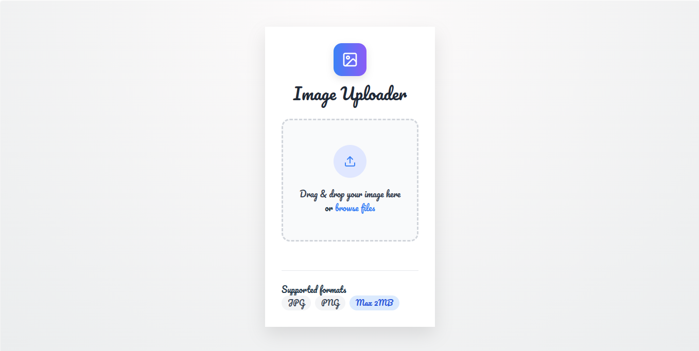

# Image Uploader

A full-stack image uploader application using **React** for the frontend and **Node.js + MinIO** for the backend. Users can drag-and-drop or browse images, upload them to MinIO and preview or download them immediately.  

---

## Table of Contents
- [Overview](#overview)
- [Features](#features)
- [Project Structure](#project-structure)
- [Frontend Setup](#frontend-setup)
- [Backend Setup](#backend-setup)
- [Environment Variables](#environment-variables)
- [Usage](#usage)
- [File Restrictions](#file-restrictions)
- [Dependencies](#dependencies)

---

## Overview
This project demonstrates a full-stack image uploader:

- **Frontend**: React app with drag-and-drop, preview and download functionality  
- **Backend**: Node.js server using Multer for uploads and MinIO for object storage  

---

## Features
- Drag and drop file upload interface with visual feedback  
- Real-time image preview  
- Download uploaded images directly  
- File validation for type and size  
- Status notifications for success, error and loading  
- Responsive design for mobile and desktop  

---

## Project Structure
```
image-uploader/
├── frontend/
│   ├── src/
│   │   ├── App.jsx          # Main React component
│   │   ├── App.css          # Frontend styles
│   │   ├── main.jsx         # React entry point
│   ├── package.json         # Frontend dependencies & scripts
│   └── vite.config.js       # Vite configuration
├── backend/
│   ├── index.js             # Express server entry point
│   ├── config/
│   │   └── minio-conf.js    # MinIO configuration
│   ├── controllers/
│   │   └── uploadController.js
│   ├── middleware/
│   │   └── uploads.js
│   ├── routes/
│   │   └── upload.js
│   ├── package.json         # Backend dependencies & scripts
│   └── .env                 # Environment variables
└── README.md
```

---

## Frontend Setup

### Prerequisites
- Node.js (v14 or higher)  
- npm or yarn package manager  

### Installation
```bash
cd frontend
npm install
```

### Environment Variables
Create a `.env` file in `frontend`:
```env
VITE_BACKEND_API_URL=http://localhost:3000/api/upload
```

### Scripts
- `npm run dev` - Start development server  
- `npm run build` - Build for production  
- `npm run preview` - Preview production build  

---

## Backend Setup

### Prerequisites
- Node.js (v14 or higher)  
- MinIO server running and accessible  

### Installation
```bash
cd backend
npm install express multer minio dotenv cors
cp .env.example .env
node --watch index.js
```

### API Endpoint

#### `POST /api/upload`
Uploads a single image to MinIO.

**Request:**
- Content-Type: `multipart/form-data`  
- Field: `image` (file)  

**Response:**
```json
{
  "fileName": "timestamp-originalname.jpg",
  "url": "https://minio.example.com/presigned-url"
}
```

**Errors:**
- 400 - No file uploaded / invalid file type  
- 400 - File too large (max 5MB)  
- 500 - MinIO upload or URL generation error  

---

## Environment Variables
Create `.env` in `backend`:

```env
# MinIO Configuration
MINIO_ENDPOINT=
MINIO_PORT=9000
MINIO_USE_SSL=false
MINIO_ACCESS_KEY=
MINIO_SECRET_KEY=
MINIO_BUCKET=

# Application
FRONTEND_URL=http://localhost:5173
PORT=3000
```

---

## Usage
1. Start backend:  
```bash
cd backend
node index.js
```
2. Start frontend:  
```bash
cd frontend
npm run dev
```
3. Open browser: `http://localhost:5173`  
4. Drag & drop or browse an image to upload  
5. Preview uploaded image and download if needed  

---

## File Restrictions
- Accepted formats: JPG, JPEG, PNG, GIF, WebP  
- Maximum file size: 5MB  
- Maximum files: 1 at a time  

---

## Dependencies

**Frontend:**
- React, react-dropzone, axios, lucide-react, Vite  

**Backend:**
- express, multer, minio, dotenv, cors  
